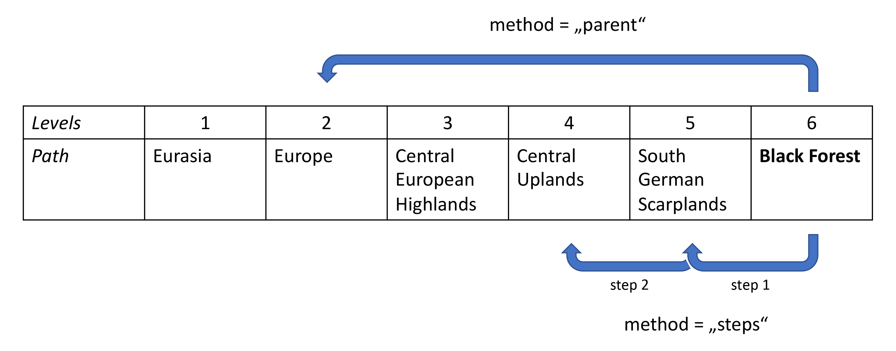

# *gmbaR*: A set of R functions to work with the GMBA Inventory v2.0

The GMBA Mountain Inventory v2.0 is an inventory of 8329 mountain ranges across the world, stored in a shapefile with a growing attribute table. Here, we provide a few R functions to explore the inventory and select mountain ranges based on user define criteria for subsequent analyses. 

When using the inventory and/or *gmbaR* for your work, please cite the inventory publication as follows:

**CITATION**
 
 

### The inventory
The GMBA Mountain Inventory v2.0 consists of two main files that are available on the [EarthEnv](https://www.earthenv.org/mountains) project website:

##### The inventory shapefile
The inventory shapefile *GMBA_Inventory_v2.0.shp* contains the spatial data of the GMBA Inventory v2.0.

##### The Selection Tool
The selection tool *Selection file.xlsx* is an Excel sheet providing the hierarchy data of the GMBA Inventory v2.0. When opening this in Excel, you have access to the full mountain inventory except the spatial data. You can manually select those mountain ranges you want to further use in your work in column AA ("Range_Selector") of the Excel sheet and then save the file for further use. For example, with *gmba_ids_from_selectiontool* from *gmbaR*, you can directly read the selected IDs to R.

Alternatively, you can use `gmba_select()` from *gmbaR* to filter and select mountain ranges from the inventory.
 
 

### Installing *gmbaR*
If needed, use `install.packages("devtools")` to install the *devtools* package.

Then, use `devtools::install_github("GMBA-biodiversity/gmbaR")` to install *gmbaR*.
 
 

### Reading the inventory to R
Before working with the GMBA Inventory v2.0, you need to read it to R. This can be done using *gmba_read*, either directly from the web or from your local drive.

Thereafter, the inventory is stored in the function *gmba_inv* (similarly to the *gmbaR* functions starting with "*gmba_*"). This is because the inventory is used as reference/resource in the other *gmbaR* functions and therefore should not be renamed or edited. If you want to explore the inventory manually, you can do so with `View(gmba_inv())`. With `objectname <- gmba_inv()` you can turn the inventory into an object and further work with it as desired.
 
 

### Working with *gmbaR*

Next to reading the inventory, the main functionalities of *gmbaR* are to 

* explore the GMBA Inventory v2.0 (*gmba_search_names*, *gmba_names_from_ids*), 
* get mountain range IDs (*gmba_ids_from_names*, *gmba_ids_from_points*, *gmba_lower_id_from_higher*, *gmba_ids_from_selectiontool*), and 
* subset the inventory based on mountain range IDs (*gmba_subset*).

The function `gmba_select()` can be used for all three functionalities.

##### gmba_lower_id_from_higher
For analyses across scales, `gmba_lower_id_from_higher()` allows to take a certain mountain range, for example the Black Forest (ID = 11175) and get a certain lower level from its GMBA Inventory v2.0 hierarchy: With `method = "parent"`, you can choose a specific lower level of the given input ID; with `method = "steps"`, you can specify the number of lower levels you want to get from perspective of the given mountain range ID. See the figure for a visual explanation of the two methods, with `lowerlevel_numeric = 2`:

 
 
 
 
 
 
 
 
 

***

For more details and examples, see the help of the package or functions.
